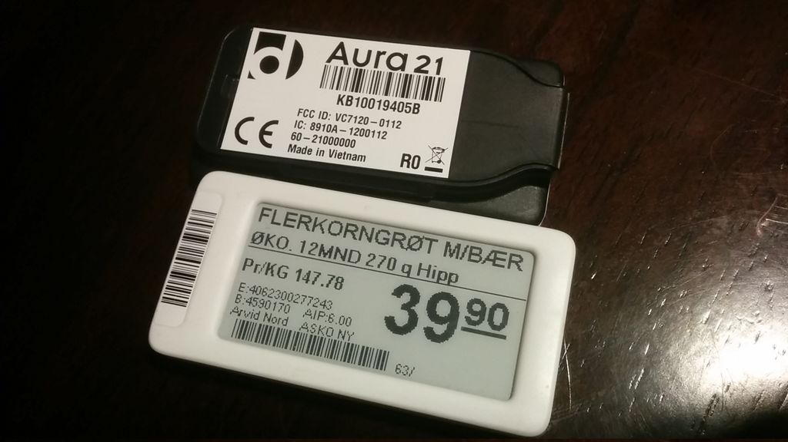

# RfCat for Aura21 (CC1110)

This is a port of rfcat for the [Aura21](https://www.displaydata.com/solutions) electronic price tag. This code only makes use of the CC1110 RF chip, not the epaper display nor the SPI flash on the PCB. Patches welcome for those!

This code is heavily based off of the port of rfcat for the [Edison Explorer Board](https://github.com/EnhancedRadioDevices/rfcat). More generally this code can be used to interact with any CC1110-based device.

This is a stripped down README to show how to get the Aura21 working with rfcat. For more information about rfcat see the [rfcat project](https://github.com/atlas0fd00m/rfcat).

Note, use the Aura21 branch.

## Photos



Note I've desoldered the SPI flash chip from the PCB in the below photo.


The back of the PCB has test points. The CC1110 debug port, used for programming (see below), uses TP2, TP3, and TP5.


## Pin mappings

Requires soldering skills. See [CC1110 datasheet](http://www.ti.com/product/CC1110-CC1111#).

### Programming pins

To program the CC1110, wire to the debug port as described in the document [CC1110/ CC2430/ CC2510 Debug and Programming Interface Specification](http://www.ti.com/lit/ug/swra124/swra124.pdf). The pin mapping for programming from a Raspberry Pi would be something like:

```
CC1110 PIN        Aura21 pad        Raspberry Pi GPIO       mraa PIN
P2_1 (debug)      TP3               BCM 17                  11
P2_2 (clock)      TP5               BCM 18                  12
RESET_N (reset)   TP2               BCM 27                  13
```

If you use different Pi GPIO/mraa pins, just make sure to use the same pins when flashing with ccprog (see below).

### SPI communication

To talk to the Aura21 using rfcat, we could use either serial or SPI. Only SPI is implemented, and the pin mapping is as follows:

```
CC1110 PIN        Aura21 pad        Raspberry Pi GPIO
P0_2              Not broken out    BCM 8 (probably not needed unless using more than one SPI slave)
P0_3              SCLK SPI flash    BCM 11
P0_4              MOSI SPI flash    BCM 10
P0_5              MISO SPI flash    BCM 9
```

**Important:**
* You need to enable spi0 on the Raspberry Pi.
* Install the included spi_serial, check the the CC1110 reset pin mapping for your pinout.
* Install the included rflib.
* There is a bug in the SPI code of mraa which does not correctly parse the spi device on the Raspberry Pi. See workaround [here](https://github.com/intel-iot-devkit/mraa/issues/947) (requires changing one line of code and recompiling, hard codes the chip select to the above pin mapping).

### Wiring photos

Below photos: grey wires are +3.3V, GND, debug, debug clock, reset. Coloured wires: green (MOSI), blue (MISO), yellow (CLK), orange (CS). The SPI flash was removed and the pads used as connections to the CC1110 SPI port (see datasheet).


## Building firmware

1. Clone this repo.
2. Install dependencies (sdcc).
3. `cd rfcat/firmware`
4. `make aura21fw`

## Flashing firmware

Programming can be done with [ccprog](https://github.com/ps2/ccprog), which uses [mraa](https://github.com/intel-iot-devkit/mraa) and thus mraa pin numbering:

`sudo ccprog -p 12,11,13 erase`

`sudo ccprog -p 12,11,13 write bins/Aura21.hex`

`sudo ccprog -p 12,11,13 reset`

Programming should be done as above, it is important to erase before writing new firmware.

## Installing client

### Dependencies
* python-usb
* libusb

Install rfcat onto your system.  on most linux systems, this will place `rfcat` and `rfcat_server` in `/usr/local/bin/` and `rflib` into `/usr/*/lib/python2.x/dist-packages`

### Installation

* cd into the rfcat directory (created by unpacking the tarball or by hg clone)
* sudo python setup.py install
* I highly recommend installing `ipython`
  * For deb/ubuntu folk: `apt-get install ipython`

## Using rfcat

If you have configured your system to allow non-root use:

* type "rfcat -r"   (if your system is not configured to allow non-root use, prepend "sudo" or you must run as root)
    you should have now entered an interactive python shell, where tab-completion and other aids should make a very powerful experience
    i love the raw-byte handling and introspection of it all.

* try things like:
    * d.ping()
    * d.discover()
    * d.debug()
    * d.RFxmit('blahblahblah')
    * d.RFrecv()
    * print(d.reprRadioConfig())
    * d.setMdmDRate(19200)      # this sets the modem baud rate (or DataRate)
    * d.setPktPQT(0)            # this sets the preamble quality threshold to 0
    * d.setEnableMdmFEC(True)   # enables the convolutional Forward Error Correction built into the radio


while the toolset was created to make communicating with <ghz much easier, you will find the cc1111 manual from ti a great value.  the better you understand the radio, the better your experience will be.
play with the radio settings, but i recommend playing in small amounts and watch for the effects.  several things in the radio configuration settings are mandatory to get right in order to receive or transmit anything (one of those odd requirements is the TEST2/1/0 registers!)

If you watched any of my talks on rfcat, you will likely remember that you need to put the radio in **IDLE state** before configuring. (I said it three times, in a row, in different inflections).

However, you will find that I've done that for you in the client for most things.  The only time you need to do this yourself are:
    * If you are doing the changes in firmware
    * If you are using the "d.poke()" functionality
        * if you use "d.setRFRegister()", this is handled for you
        * `use d.setRFRegister()`

## Epilogue

Other than that, hack fun, and feel free to share any details you can about successes and questions about failures you are able!

@ and the rest of the development team.

